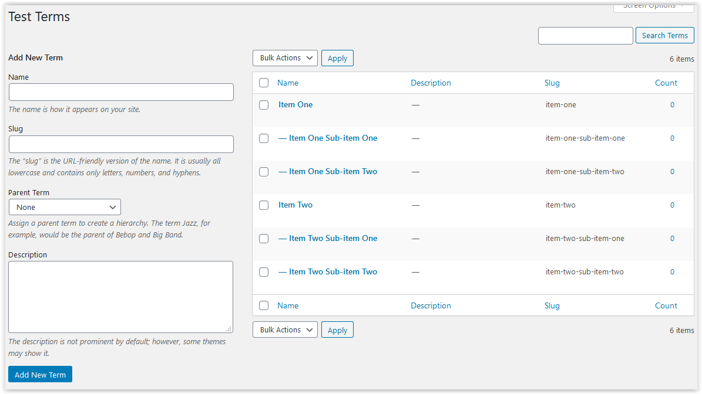
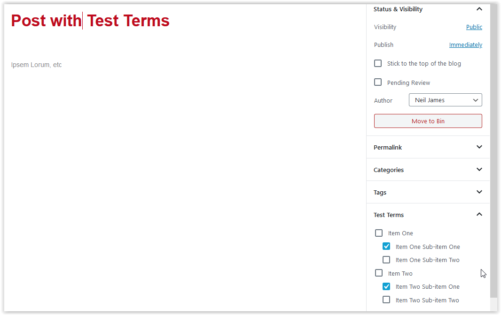
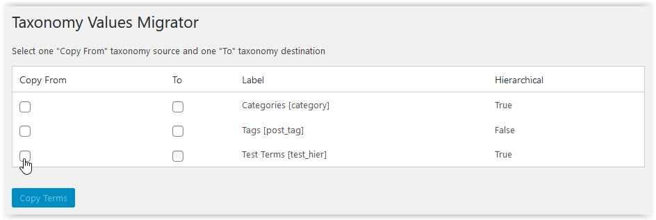
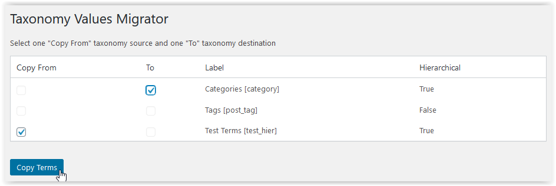
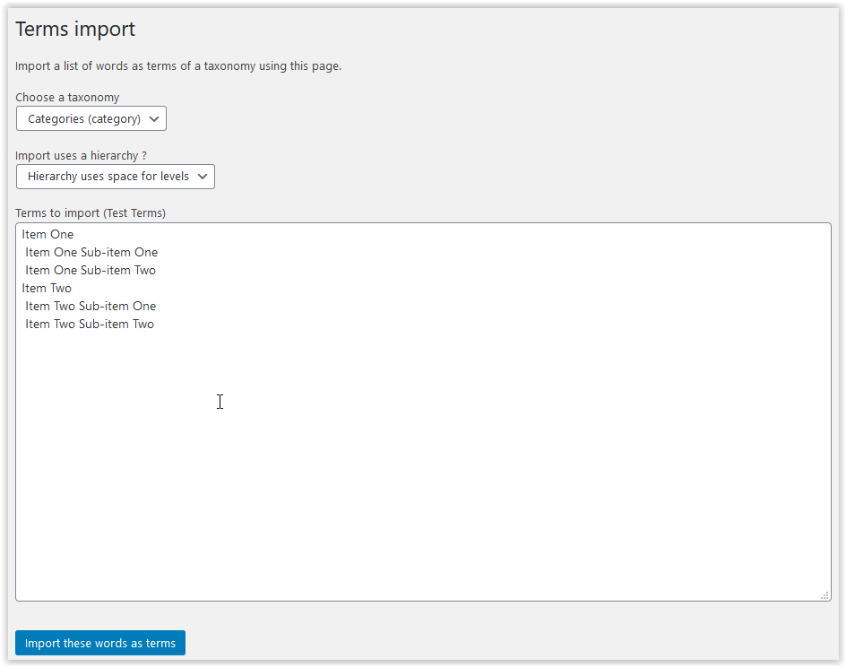
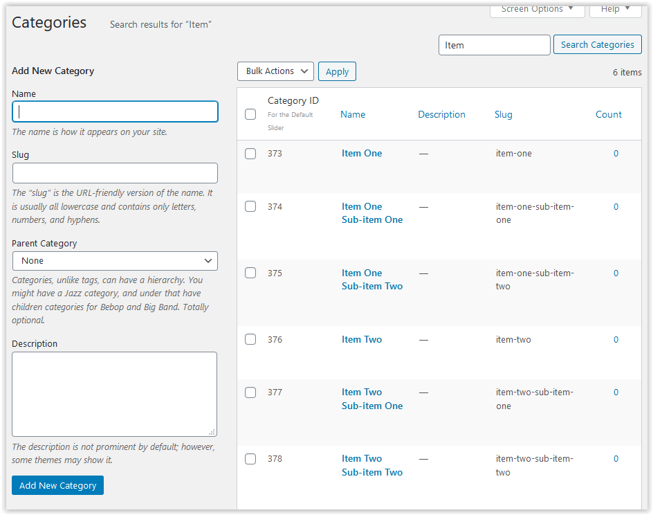
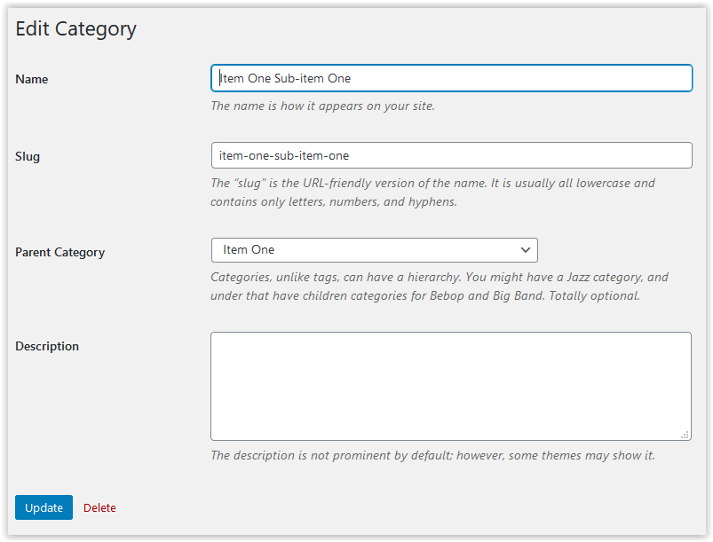
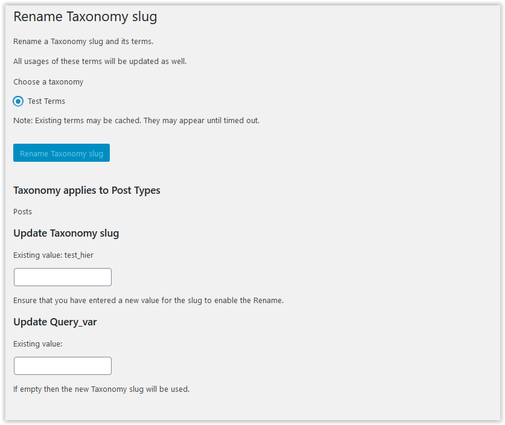
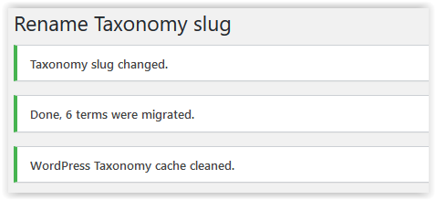

# Example Plug-in Usage

## Creation of a Taxonomy

We will add a taxonomy called test_hier with a few minimal attributes on the various panels:

<u>Main Options</u>       

	Name: test_hier
	Type: Hierarchical
	Attached to: Posts
	Display Terms with Posts: Content
	Display Terms Before text: Test Terms :

<u>Labels</u>

	Name: Test Terms
	Singular Name: Test Term

And then added using the *Add Taxonomy* button.

## Display of a Taxonomy

The listing will now contain the Taxonomy:

Clicking on *Export PHP* will download a file called test_hier.php to the browser with the content:

	 <?php
	 /*
	 Plugin Name: XXX - Test Terms
	 Version: x.y.z
	 Plugin URI: http://www.example.com
	 Description: XXX - Taxonomy Test Terms
	 Author: XXX - Simple Taxonomy Refreshed Generator
	 Author URI: http://www.example.com
	 
	 ----
	 
	 Copyright 2023 - XXX-Author
	 
	 This program is free software; you can redistribute it and/or modify
	 it under the terms of the GNU General Public License as published by
	 the Free Software Foundation; either version 3 of the License, or
	 (at your option) any later version.
	 
	 This program is distributed in the hope that it will be useful,
	 but WITHOUT ANY WARRANTY; without even the implied warranty of
	 MERCHANTABILITY or FITNESS FOR A PARTICULAR PURPOSE.  See the
	 GNU General Public License for more details.
	 
	 You should have received a copy of the GNU General Public License
	 along with this program; if not, write to the Free Software
	 Foundation, Inc., 59 Temple Place, Suite 330, Boston, MA  02111-1307  USA
	 */
	 
	 add_action( 'init', 'register_staxo_test_hier', 10 );
	 
	 function register_staxo_test_hier() {
	 register_taxonomy( "test_hier", 
	   array (
	   0 => 'post',
	 ),
	   array (
	   'name' => 'test_hier',
	   'description' => '',
	   'labels' => 
	   array (
	     'name' => 'Test Terms',
	     'singular_name' => 'Test Term',
	     'search_items' => 'Search Categories',
	     'popular_items' => '',
	     'all_items' => 'All Categories',
	     'parent_item' => 'Parent Category',
	     'parent_item_colon' => 'Parent Category:',
	     'name_field_description' => 'The name is how it appears on your site.',
	     'slug_field_description' => 'The “slug” is the URL-friendly version of the name. It is usually all lower case and contains only letters, numbers, and hyphens.',
	     'parent_field_description' => 'Assign a parent term to create a hierarchy. The term Jazz, for example, would be the parent of Bebop and Big Band.',
	     'desc_field_description' => 'The description is not prominent by default; however, some themes may show it.',
	     'edit_item' => 'Edit Category',
	     'view_item' => 'View Category',
	     'update_item' => 'Update Category',
	     'add_new_item' => 'Add New Category',
	     'new_item_name' => 'New Category Name',
	     'separate_items_with_commas' => '',
	     'add_or_remove_items' => '',
	     'choose_from_most_used' => '',
	     'not_found' => 'No categories found.',
	     'no_terms' => 'No categories',
	     'filter_by_item' => 'Filter by category',
	     'items_list_navigation' => 'Categories list navigation',
	     'items_list' => 'Categories list',
	     'most_used' => 'Most Used',
	     'back_to_items' => '← Go to Categories',
	     'item_link' => 'Category Link',
	     'item_link_description' => 'A link to a category.',
	     'name_admin_bar' => '',
	     'archives' => 'All Categories',
	   ),
	   'public' => true,
	   'publicly_queryable' => true,
	   'hierarchical' => true,
	   'show_ui' => true,
	   'show_in_menu' => true,
	   'show_in_nav_menus' => true,
	   'show_tagcloud' => true,
	   'show_in_quick_edit' => true,
	   'show_admin_column' => true,
	   'capabilities' => 
	   array (
	     'manage_terms' => 'manage_categories',
	     'edit_terms' => 'manage_categories',
	     'delete_terms' => 'manage_categories',
	     'assign_terms' => 'edit_posts',
	   ),
	   'rewrite' => false,
	   'query_var' => 'test_hier',
	   'update_count_callback' => '',
	   'show_in_rest' => true,
	   'sort' => false,
	 ) );
	 }
	 // Display Terms with Posts: content
	 // Display Terms Before text: Test Terms:
	 // Display Terms Separator: , 
	 // Display Terms After text: 
	 // Show Terms in Feeds: 0

This can be included in your own code - but then should be deleted as a custom taxonomy.

You can also use it as a single page reference, which is why the last comment lines have been added.

## Adding Terms to the taxonomy
Since show_in_menu is set to true, it is available as a sub-menu from the Posts menu.

However, we'll add some via the Terms import]functionality.

Enter the four terms for the taxonomy using leading tabs to denote the levels:

Once the Import these words as Terms button have been pressed, we can see them in the Terms screen.

## Using the Taxonomy in the Post

Now create a post using the block editor with some Terms added:

When viewing the Post, we can see the terms that have been added:

## Migrating Terms

We can use the Terms migrator to copy the terms from one taxonomy to another.

We will copy the ones just entered into Categories. After clicking on the *Copy From* of the Test Terms taxonomy.

Various options have been made unavailable as a result of that initial click. Click on the *To* option of the Category taxonomy. 

Now that both options have been selected, the Copy Terms button has become available.

Once this is clicked, it is now possible to click the *Copy Terms* button. This extracts the *all* the terms making them available in the Terms import form.

### Importing the Terms

When the Import button is clicked, the data will be loaded. Confirmation messages are output.

These show the number of non-blank lines processed, together with the number of terms created (if any).

As the same screen (and data) is returned to the user, clicking the Import button again shows a slightly different message. The same number of items have been processed, but nothing has added. 

When the data is entered, they can be seen within the Categories Terms

As the data has been entered hierarchically, this is how it is loaded.

## Changing the Taxonomy Slug

Normally you cannot change the taxonomy slug since any terms that have been defined for it will use that slug.

Whilst you can create a second custom taxonomy with similar parameters and use the export/import migration capabilities, this will not move any term usages across.

A tool (Rename Taxonomy Slug) has been provided for that purpose only.

You select the taxonomy to be changed and it shows you existing values. Enter the new slug name.

Because the query_var and rewrite slug are closely related to the taxonomy slug, these are displayed and are optionally updatable here.

Since the rewrite option was not defined with this basic example, it is not shown on this screen.

The Rename Taxinomy button is now active and once checked the data can be clicked. The processing done is given.

After this is done, you might wish to use the menu to look at the new taxonomy. If clicked on, then you will get an invalid taxonomy message.

This is because it still has the old slug name - which no longer exists. So before doing this refresh the page.

You will be able to see the terms using the new slug - and all the terms are there - and all the posts have the same terms attached.
